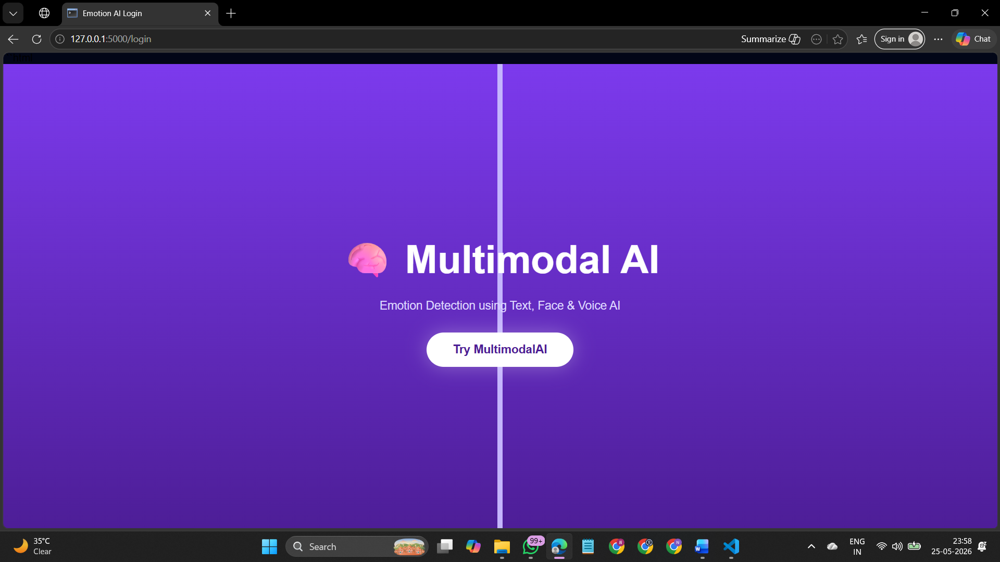
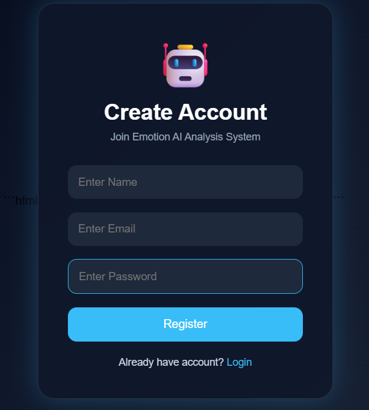
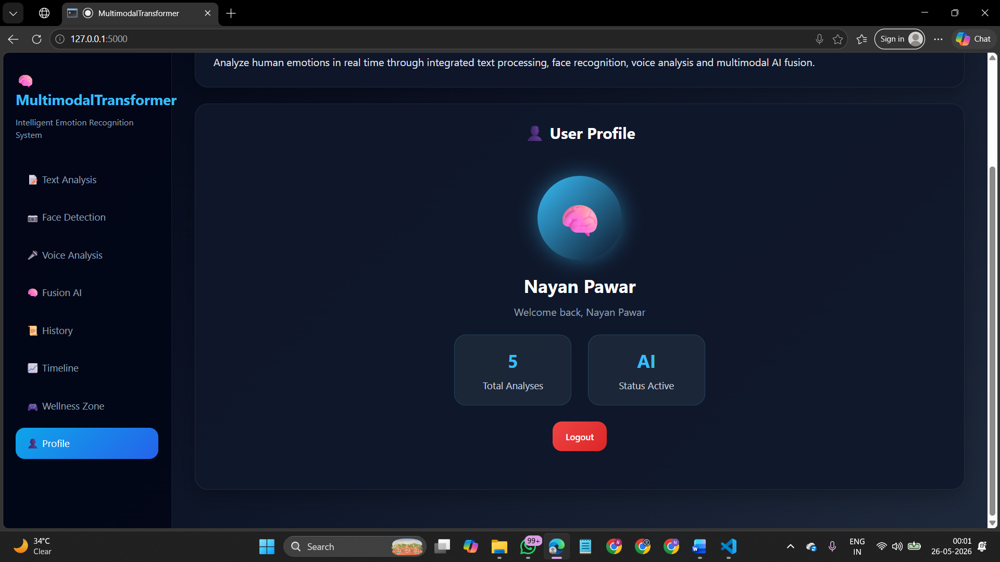
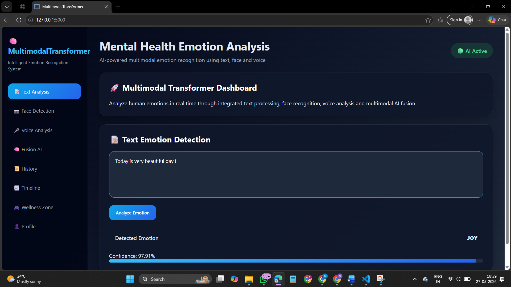
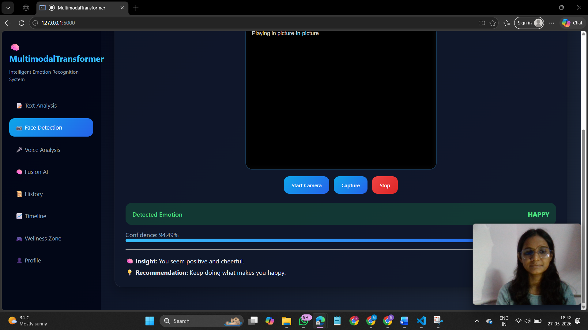
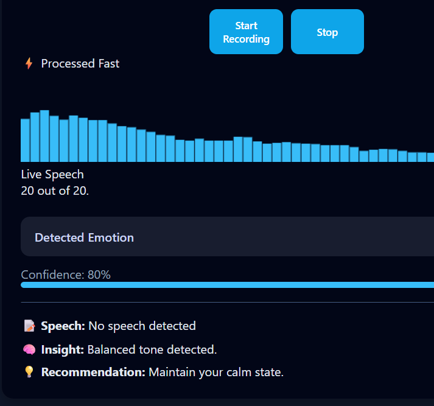
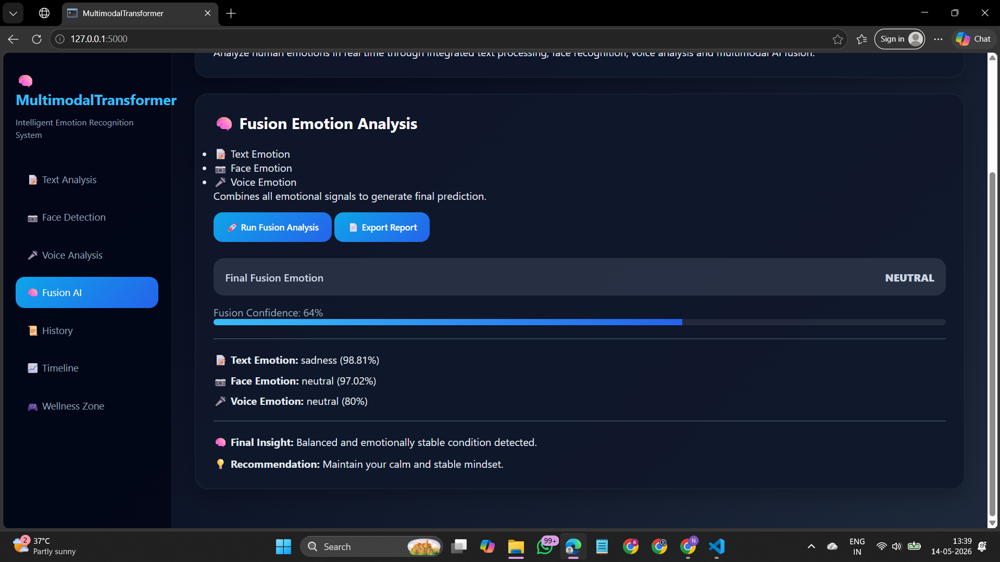
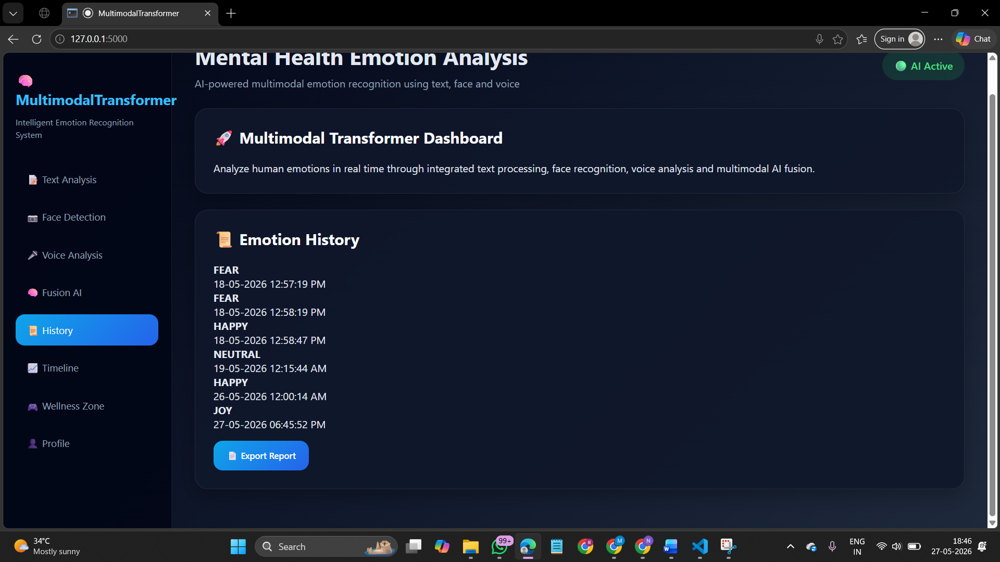
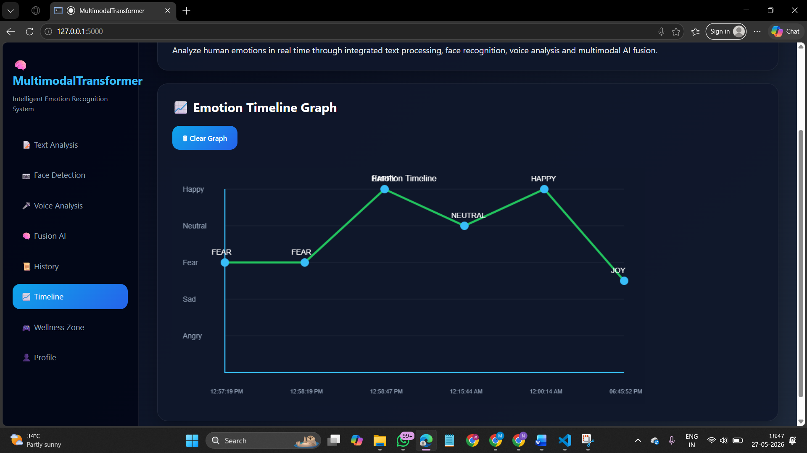
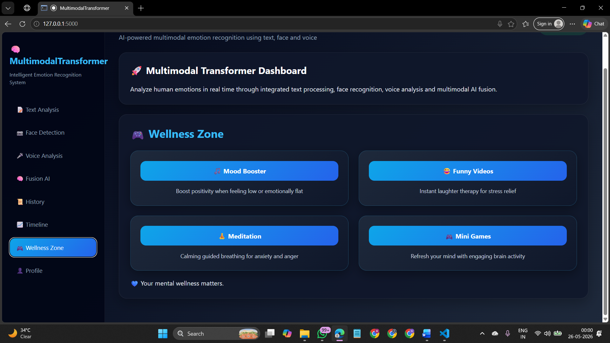

# 🧠 Multimodal Transformer: Intelligent Emotion Recognition System

## 📌 Project Overview

The **Multimodal Transformer: Intelligent Emotion Recognition System** is an AI-based application that detects human emotions using multiple input modalities including **Text, Facial Expressions, and Voice Signals**. The system combines predictions from different emotion recognition models and generates a final emotion result through multimodal fusion analysis.

The project aims to improve emotion recognition accuracy compared to traditional single-modality systems and provides emotion history tracking, graphical mood visualization, and real-time emotion monitoring through a web-based interface.

---


## 🏗️ System Architecture

User Input (Text / Face / Voice)

↓

Input Processing & Preprocessing

↓

Text Emotion Detection | Face Emotion Detection | Voice Emotion Detection

↓

Multimodal Fusion Analysis

↓

Final Emotion Prediction

↓

Database Storage & Visualization

---

## 🛠️ Technologies Used

### Frontend

* HTML
* CSS
* JavaScript

### Backend

* Flask (Python)

### Database

* MySQL

### AI & Machine Learning

* TensorFlow
* Keras
* Transformers
* OpenCV
* NumPy
* Pandas
* Scikit-Learn

### Visualization

* Matplotlib
* Chart.js

---

## 📂 Project Modules

1. User Authentication Module
2. Text Emotion Analysis Module
3. Facial Emotion Detection Module
4. Voice Emotion Detection Module
5. Multimodal Fusion Module
6. Emotion History Module
7. Graph Visualization Module

---

#  ScreenShots

### Main UI Design


### Login & Registration

## Registration Page


## Login Page


## User Profile


### Emotion Analysis Results









---

## 📊 Dataset

The project uses:

* Text Emotion Datasets
* Facial Expression Datasets
* Speech Emotion Datasets
* Publicly Available AI Datasets

Dataset Sources:

* Kaggle
* Research Papers
* Open Source Repositories

---

## ⚙️ Installation

### Clone Repository

```bash
git clone https://github.com/your-username/Multimodal-Emotion-Recognition.git
cd Multimodal-Emotion-Recognition
```

### Create Virtual Environment

```bash
python -m venv venv
```

### Activate Environment

```bash
venv\Scripts\activate
```

### Install Dependencies

```bash
pip install -r requirements.txt
```

### Run Application

```bash
python app.py
```

---

## 🚀 Features

* Text Emotion Analysis using NLP
* Facial Emotion Detection using OpenCV and Deep Learning
* Voice Emotion Recognition
* Multimodal Fusion Analysis
* User Authentication (Login & Registration)
* Emotion History Tracking
* Mood Timeline Graph Visualization
* AI-Based Emotion Insights
* Interactive Web Interface

---

## 🎯 Applications

* Mental Health Monitoring
* Smart Education Systems
* Healthcare Applications
* Human Computer Interaction
* AI Assistants and Chatbots
* Behavioral Analysis Systems

---

## 📈 Future Scope

* Cloud Deployment
* Mobile Application Integration
* Advanced Transformer Models
* Real-Time Counseling Support
* Multilingual Emotion Analysis
* AI-Based Recommendation System

---

## 👨‍💻 Developed By

Nayan Pawar

BTech AIML

Mini Project – 2025-26

---

## 📚 References

* Python Documentation
* Flask Documentation
* TensorFlow Documentation
* OpenCV Documentation
* HuggingFace Transformers
* Kaggle Datasets
